<h1 align="center">
  
</h1>

<h2 align="center">
  Competitive Programmer and a WIP Computer Engineer from México ᴍx.
</h2>

  
  
 
 

  <h3>Studying at UNAM School of Engineering</h3>

<h2 align="center">🔨Languages-Frameworks-Tools⛏</h2>

  <table style="border: 2px solid black;">
    <tr>
      <td valign="center">
   
   
  
      </td>
      <td valign="top">
        <h3 align="center">I'm actually learning:</h3>

  

      </td>
    </tr>
  </table>
  

<h2 align="center">My Outstanding Proyects</h2>

  <table>
    <tr>
      <td valign="top">
        
      </td>
      <td valign="center">
        
      </td>
    </tr>
  </table>

  

    
    &nbsp;&nbsp; 
  

  

<h2 align="center">Competitive Programming</h2>

  
I solve problems in these platforms:

  
  
  &nbsp;&nbsp; 

     
   
  

  
... and you can find all my solutions in this repository:

  
  
    

